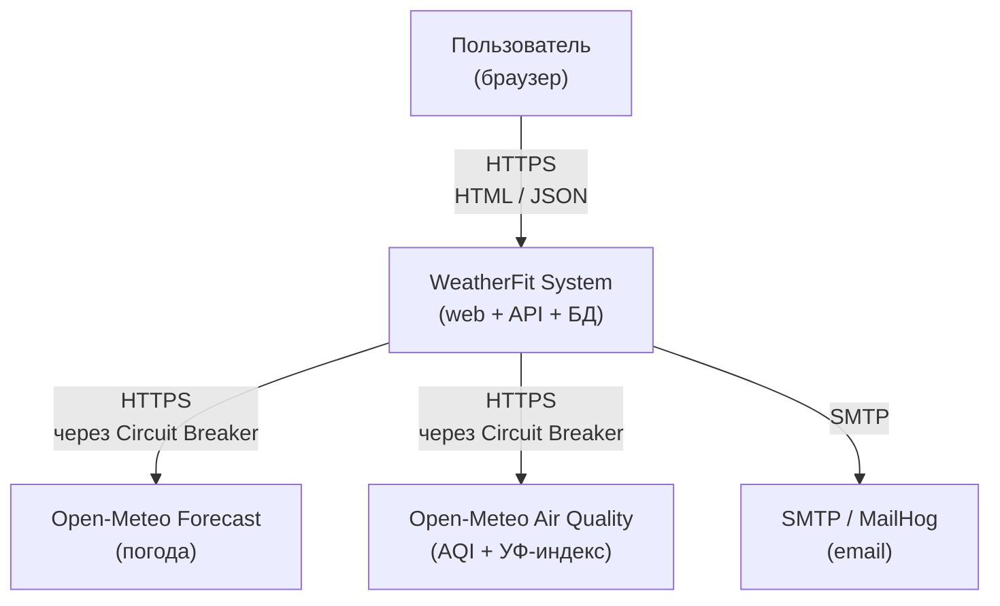
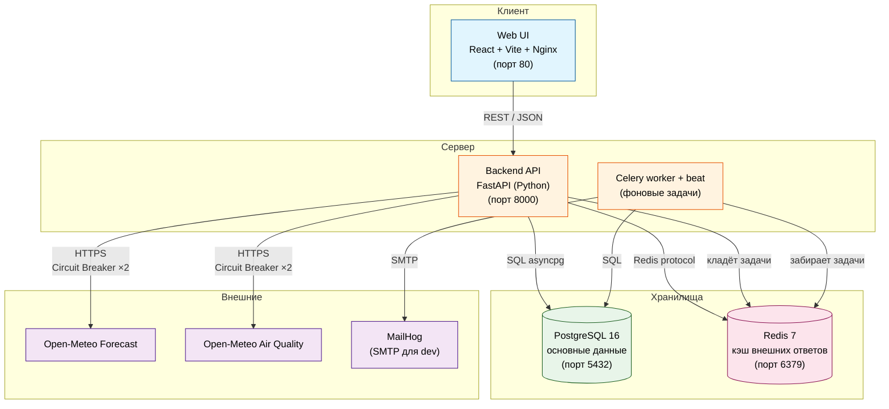
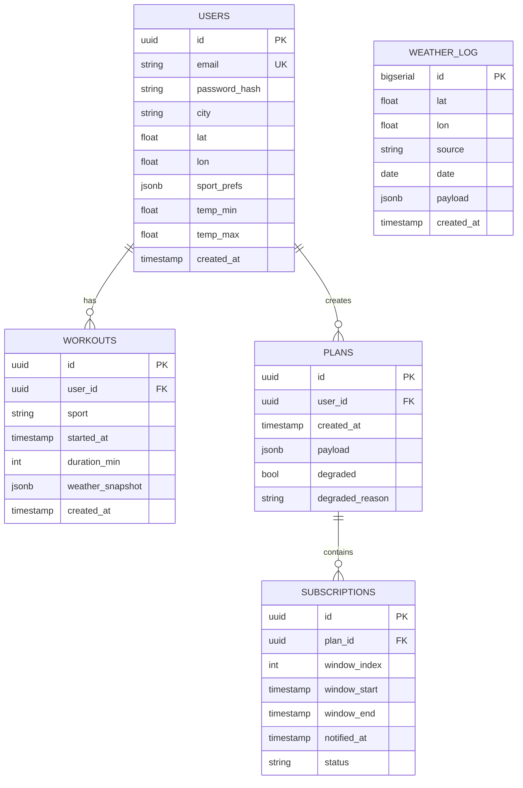
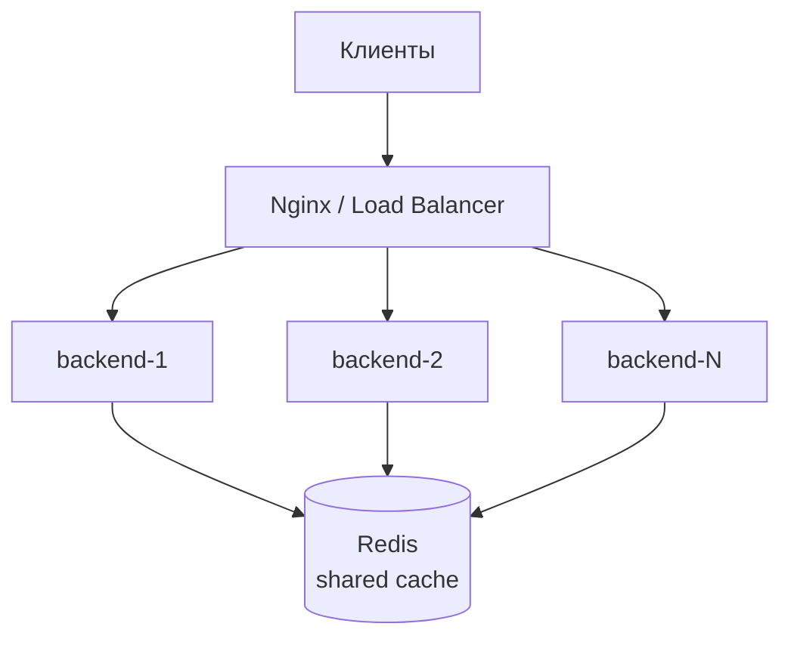
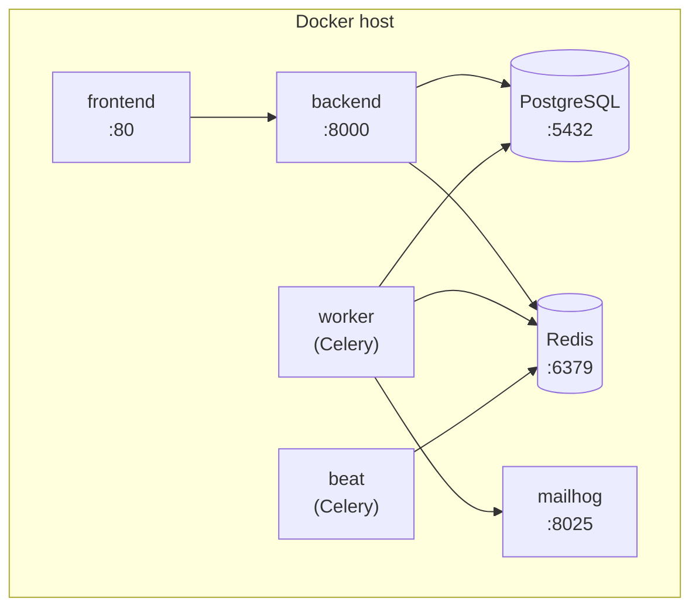

WeatherFit

Сервис автоматического построения персонального плана уличных тренировок

на неделю с учётом прогноза погоды, качества воздуха и УФ-индекса.

Участники

|ФИО|Группа|Роль|
|-|-|-|
|Жазыбаева Бермет|40106|Backend, БД, интеграции, CI|
|Орозалиева Элвира|40106|Frontend, Docker, тесты, документация|

Преподаватель: Юркин В. А.

Этап 1. Определение проблемы и тема

Проблема:

Люди, которые регулярно тренируются на улице (бег, велосипед, воркаут),

сталкиваются с тем, что погода и условия среды (качество воздуха, УФ-индекс,

ветер, осадки) ломают их тренировочный план: приходится вручную сопоставлять

прогноз с расписанием, типом тренировки и личными ограничениями. Это отнимает

время, приводит к пропущенным занятиям и к тренировкам в небезопасных

условиях (например, бег в смог или в пик УФ-индекса).

Тема проекта:

WeatherFit — сервис автоматического построения персонального плана

уличных тренировок на неделю с учётом прогноза погоды, качества воздуха

и УФ-индекса, с уведомлениями о подходящих временных окнах.

Что именно делает сервис:

1\. Пользователь задаёт параметры плана: тип тренировки (бег / велосипед /

&#x20;  воркаут), длительность одной сессии, желаемую частоту в неделю,

&#x20;  допустимые диапазоны температуры и влажности, город.

2\. Сервис строит расписание на 7 дней: для каждого дня находит одно или

&#x20;  несколько временных окон, в которые условия удовлетворяют и типу

&#x20;  тренировки, и личным ограничениям пользователя.

3\. Для каждого окна сервис объясняет выбор: какие именно факторы повлияли

&#x20;  (например, «температура 14 °C, ветер 3 м/с, УФ-индекс 2, качество

&#x20;  воздуха 32 AQI — все в комфортной зоне»).

4\. Пользователь подписывается на окно, и сервис присылает уведомление

&#x20;  за 2 часа до его начала.

5\. Если один из внешних источников (например, Air Quality API) недоступен,

&#x20;  сервис строит план по оставшимся данным и помечает его как

&#x20;  «предварительный» (degraded mode).

Стек технологий:

|Слой|Технология|
|-|-|
|Backend|Python 3.12 + FastAPI|
|База данных|PostgreSQL 16 + Alembic|
|Кэш|Redis 7|
|Frontend|React 18 + TypeScript + Vite|
|Внешний API №1|Open-Meteo Forecast (погода)|
|Внешний API №2|Open-Meteo Air Quality (AQI, УФ-индекс)|
|Контейнеризация|Docker + Docker Compose|
|CI/CD|GitHub Actions|
|Уведомления|SMTP (MailHog в dev)|

Этап 2. Требования

2.1. Пользовательские истории (User Stories)

US-1. Построение недельного плана тренировок

> Как пользователь, который тренируется 3 раза в неделю по часу, 

> я хочу задать тип тренировки, длительность и частоту, и получить 

> готовое расписание на 7 дней с конкретными временными окнами, 

> чтобы не тратить время на ручной подбор.

Критерии приёмки:

\- Пользователь задаёт: sport, duration\_min, sessions\_per\_week, 

&#x20; city, опционально — диапазоны температуры, влажности, ветра.

\- API возвращает массив из 7 дней; в каждом дне — 1–3 окна.

\- Каждое окно имеет: start, end, score (0–100), explanation (строка).

\- Если за 7 дней найдено меньше окон, чем sessions\_per\_week, 

&#x20; сервис возвращает warning: «недостаточно окон» и лучшие частичные варианты.

\- Время ответа p95 < 500 мс при наличии кэша.

US-2. Объяснение выбора окна

> Как пользователь, я хочу видеть, почему сервис выбрал именно это окно, 

> чтобы доверять рекомендации и понимать компромиссы.

Критерии приёмки:

\- Каждое окно содержит поле explanation — список факторов с оценкой:

&#x20; «temp=14°C (comfort)», «wind=3m/s (good)», «aqi=32 (good)», «uv=2 (low)».

\- Если окно выбрано в degraded-режиме (см. US-5), в объяснении явно 

&#x20; указано: «predicted without air quality data».

US-3. Подписка на уведомление об окне

> Как занятый пользователь, я хочу подписаться на подходящее окно, 

> и получить уведомление за 2 часа до его начала, чтобы успеть собраться.

Критерии приёмки:

\- POST /api/v1/subscriptions принимает window\_id.

\- Фоновый воркер (Celery beat) раз в 10 минут проверяет подписки.

\- Email отправляется ровно один раз, за 110–120 минут до window.start.

\- Повторных отправок нет (идемпотентность по subscription\_id).

\- Если внешний API упал и window стал невалидным — отправляется 

&#x20; письмо-отмена с пометкой.

US-4. История тренировок и статистика

> Как пользователь, я хочу видеть историю своих тренировок и условий, 

> в которых они проходили, чтобы анализировать, при каких условиях 

> мне комфортнее.

Критерии приёмки:

\- GET /api/v1/workouts?page=N\&size=20 — пагинация.

\- Для каждой записи: sport, started\_at, duration\_min, 

&#x20; weather\_snapshot (JSONB — снимок условий на момент тренировки).

\- Данные хранятся > 5 лет.

US-5. Деградация при недоступности внешнего источника

> Как пользователь, я хочу, чтобы сервис продолжал строить план, 

> даже если один из источников данных недоступен, и явно сообщал 

> мне об этом, чтобы я понимал, насколько рекомендации надёжны.

Критерии приёмки:

\- Если Air Quality API недоступен (Circuit Breaker OPEN):

&#x20; - GET /api/v1/plan возвращает 200 OK с degraded: true.

&#x20; - В explanation каждого окна указано, что AQI/UV не учитывались.

&#x20; - Логируется событие degraded\_mode\_active.

\- Если недоступны оба API — 503 с degraded: «all\_sources\_down».

\- Если есть устаревший кэш (< 6 ч) — отдаём его с stale: true 

&#x20; вместо ошибки.

2.2. Бизнес-правила построения плана

Правило 1. Комфортные диапазоны по типу спорта.

|Sport|t\_min|t\_max|wind\_max|precip\_max|aqi\_max|uv\_max|
|-|-|-|-|-|-|-|
|run|5 °C|25 °C|8 м/с|0.5 мм/ч|100|7|
|bike|10 °C|28 °C|10 м/с|0.2 мм/ч|100|8|
|workout|10 °C|30 °C|12 м/с|0.0 мм/ч|120|9|

Пользователь может сузить диапазоны в своём профиле; расширять 

за пределы — запрещено.

Правило 2. Score окна (0–100).

Формула учитывает отклонения температуры, ветра, осадков, AQI и UV 

от комфортных значений. Окно формируется, если score ≥ 50 для всех 

часов подряд.

Правило 3. Минимальная длина окна.

Окно должно вмещать duration\_min с запасом ±15 минут.

Правило 4. Приоритезация при конфликте.

Если в один день несколько окон — выбирается с максимальным средним 

score. Соседние окна (разрыв < 30 мин) объединяются.

Правило 5. Распределение по неделе.

Из всех подходящих окон выбираются sessions\_per\_week с учётом:

\- максимум 2 тренировки в один день,

\- минимум 1 день отдыха между интенсивными сессиями (run, bike).

2.3. Масштаб системы

\- 10 000 уникальных пользователей в сутки (DAU).

\- 8 запросов на пользователя → 80 000 запросов/сутки.

\- Peak factor 5 → \~4.6 RPS в пике.

\- 30% пользователей с активными подписками → 3 000 писем/сутки.

\- Внешние API:

&#x20; - Open-Meteo Forecast: \~10 000 запросов/сутки с IP.

&#x20; - Open-Meteo Air Quality: тот же лимит.

&#x20; - Кэш обязателен: ключ (lat, lon, date, source), TTL 30 мин.

&#x20; - Hitrate после прогрева — > 95%.

2.4. Отказоустойчивость (Fault Tolerance)

|Механизм|Реализация|
|-|-|
|Кэширование|Redis, ключ wf:{source}:{lat}:{lon}:{date}, TTL 30 мин|
|Деградация|Если один источник недоступен — план строится по оставшемуся, degraded: true. Если оба — 503|
|Stale-данные|Кэш старше 30 мин и младше 6 ч — отдаём с stale: true|
|Circuit Breaker|pybreaker, отдельный breaker на источник: fail\_max=5, reset\_timeout=120s|
|Rate Limiting|slowapi, 60 req/min на IP. Семафор на 5 одновременных запросов к внешнему API|
|Ретраи|tenacity — 3 попытки с экспоненциальным backoff (0.5s → 1s → 2s)|
|Fallback|Если оба API недоступны и кэш пуст — используем last\_known\_plan из БД с from\_cache: true|

2.5. UML-диаграмма прецедентов (Use Case)

Актор: Пользователь.

Прецеденты:

\- Зарегистрироваться

\- Настроить профиль и лимиты

\- Построить план на неделю

\- Просмотреть объяснение окна

\- Подписаться на уведомление

\- Отметить тренировку выполненной

\- Просмотреть историю

\- Получить уведомление (включает отправку через SMTP)

Связи:

\- «Построить план на неделю» включает «Получить данные из Open-Meteo (2 источника)».

2.6. Список unit-тестов бизнес-логики

\- score\_hour() — граничные значения (t = t\_min, t = t\_max).

\- find\_windows() — пустой список, одно окно, несколько окон, окно короче duration.

\- distribute\_week() — 7 окон на 3 сессии, конфликт по дню, правило «1 день отдыха».

\- apply\_personal\_limits() — попытка расширить диапазон → ошибка.

\- degrade\_plan() — отсутствие одного источника, отсутствие обоих, stale-кэш.

\- Circuit Breaker — 5 ошибок → OPEN, через 120 сек → HALF\_OPEN, успех → CLOSED.

\- explanation\_builder() — формат строки, наличие предупреждений.

Этап 3. Разработка архитектуры и детальное проектирование

3.1. Capacity Planning (анализ нагрузок)
Read/Write нагрузка

| Тип операции | Доля | Примеры |
|---|---|---|
| Read (чтение) | 95% | прогноз, план, история, профиль |
| Write (запись) | 5% | регистрация, отметка тренировки, изменение профиля |

**Соотношение Read/Write = 19:1.** Это типично для сервисов-агрегаторов: 
пользователи в основном читают данные, а записывают редко.

#### Сетевой трафик

| Параметр | Значение |
|---|---|
| DAU | 10 000 пользователей |
| Запросов на пользователя | ~8/сутки |
| Всего запросов/сутки | 80 000 |
| Peak factor | 5 (утренние и вечерние часы) |
| Peak RPS | ~4.6 запросов/сек |
| Средний размер ответа API | 30 KB |
| Исходящий трафик API в пике | ~138 KB/s ≈ 1.1 Мбит/с |
| Отдача фронтенда | ~500 KB × 10 000 = 5 GB/сутки |
| **Итого в сутки** | **~13 GB** |
| **Итого в год** | **~4.7 ТБ** |

#### Дисковая система (горизонт > 5 лет)

| Таблица | Расчёт | Объём |
|---|---|---|
| users | 10 000 × 500 B | 5 MB |
| workouts | 10 000 × 100 записей × 200 B | 200 MB |
| weather_log (аудит) | 10 000 × 30 записей × 300 B × 365 × 5 лет | 164 GB |
| plans | 10 000 × 365 × 500 B × 5 лет | 9 GB |
| subscriptions | 10 000 × 200 × 100 B × 5 лет | 1 GB |
| **Итого данные** | | **~175 GB** |
| С индексами (+30%) | | **~228 GB** |

**Решение для больших таблиц:** партиционирование `weather_log` 
по месяцам (`PARTITION BY RANGE (created_at)`). Старые партиции 
(старше 1 года) можно выгружать в холодное хранилище (S3/MinIO), 
но оставлять доступными через представление (view).

### 3.2. Архитектурные схемы (C4 Model)

#### Уровень 1. Context — кто с кем общается

**Что здесь:** пользователь → WeatherFit → два внешних источника 
данных + SMTP для отправки уведомлений.

#### Уровень 2. Container — из чего состоит система

**Описание контейнеров:**

| Контейнер | Технология | Роль |
|---|---|---|
| Web UI | React + Vite + Nginx | Интерфейс пользователя |
| Backend API | FastAPI (Python) | Бизнес-логика, REST |
| Celery worker + beat | Celery + Redis | Фоновая отправка email |
| PostgreSQL | PostgreSQL 16 | Основное хранилище |
| Redis | Redis 7 | Кэш внешних ответов + очередь задач |
| MailHog | MailHog | SMTP-сервер для dev |

### 3.3. Контракты API

Все эндпоинты под префиксом `/api/v1`. 
Формат: JSON. Аутентификация: JWT в заголовке `Authorization: Bearer <token>`.

| Метод | Путь | Описание | p95 latency | Коды ответа |
|---|---|---|---|---|
| POST | /auth/register | Регистрация | 300 ms | 201, 400, 409 |
| POST | /auth/login | Логин, выдача JWT | 200 ms | 200, 401 |
| GET | /me | Профиль пользователя | 100 ms | 200, 401 |
| PATCH | /me | Обновить профиль | 200 ms | 200, 400 |
| POST | /plan | Построить план на 7 дней | 500 ms | 200, 400, 503 |
| GET | /plan/latest | Последний построенный план | 150 ms | 200, 404 |
| GET | /forecast | Сырой прогноз (debug) | 200 ms | 200, 503 |
| POST | /subscriptions | Подписаться на окно | 200 ms | 201, 404 |
| DELETE | /subscriptions/{id} | Отменить подписку | 100 ms | 204, 404 |
| POST | /workouts | Отметить тренировку | 200 ms | 201, 400 |
| GET | /workouts | История (пагинация) | 200 ms | 200 |

**Нефункциональные требования:**
- Все эндпоинты должны отвечать p95 < 500 мс.
- При недоступности внешнего API — `503` с телом `{ "degraded": true, "reason": "..." }`.
- Rate limit: 60 запросов/мин на IP (через `slowapi`).
- Полный OpenAPI генерируется FastAPI автоматически на `/docs`.

### 3.4. Проектирование данных (ER-диаграмма)

#### Обоснование выбранной структуры

**UUID вместо автоинкрементных id:** не позволяет угадать количество 
пользователей, защищает от IDOR-атак.

**JSONB для `plans.payload`:** план — вложенная структура (дни → окна → 
факторы). Раскладывать на 5 таблиц избыточно. PostgreSQL JSONB поддерживает 
GIN-индексы для быстрого поиска.

**Партиционирование `weather_log`:** основной объём данных (164 GB за 5 лет). 
Партиции по месяцам позволяют быстро удалять старые данные 
(`DROP PARTITION`) и параллелить запросы.

#### Индексы и обоснование

| Таблица | Индекс | Тип | Зачем |
|---|---|---|---|
| users | email | UNIQUE B-tree | Поиск при логине — O(log n) |
| workouts | (user_id, started_at DESC) | составной B-tree | История с сортировкой |
| plans | (user_id, created_at DESC) | составной B-tree | Последний план |
| subscriptions | (plan_id, notified_at) | составной B-tree | Необработанные подписки |
| subscriptions | (window_start) | B-tree | Celery выбирает окна на 2 ч |
| weather_log | (lat, lon, source, date) | составной B-tree | Поиск кэш-записи |
| plans | payload | GIN | Поиск по вложенным полям |

**Почему выдержат нагрузку:** peak 4.6 RPS — очень мало. 95% чтений 
уходят в Redis и read replicas. Запись 5% (≈0.23 RPS) — не проблема 
для одной ноды PostgreSQL.

### 3.5. Масштабирование до 100 000 пользователей/сутки

При росте нагрузки в 10 раз применяем следующие шаги:

#### 1. Backend — горизонтальное масштабирование
Backend **stateless** (не хранит состояние между запросами), поэтому 
можно запустить N реплик за Nginx/HAProxy. Сессии — в JWT, не в памяти.

#### 2. Кэш внешних запросов — обязательно
Open-Meteo имеет лимит ~10 000 запросов/сутки с одного IP. 
Кэш в Redis с TTL 30 мин даёт hitrate **> 95%**. Это **критично**: 
без кэша сервис упрётся в лимит в первые же минуты.

Дополнительно: **прогрев кэша** — фоновый воркер заранее тянет прогноз 
для крупных городов и раскладывает в Redis.

#### 3. PostgreSQL — read replicas
- 1 primary (запись) + 2 read replicas (чтение).
- SELECT идут на реплики (round-robin).
- INSERT/UPDATE/DELETE — только на primary.

#### 4. CDN для статики фронтенда
React-сборка отдаётся через CDN. Backend отдаёт только API.

#### 5. Celery — отдельные пулы
- `celery-beat` — планировщик (1 инстанс, чтобы не дублировать задачи).
- `celery-worker-notifications` — отправка email (N инстансов).

#### 6. Circuit Breaker ×2
Отдельный breaker на Forecast и Air Quality. 
- `fail_max=5`, `reset_timeout=120s`.
- Состояние (`CLOSED / OPEN / HALF_OPEN`) логируется.

#### 7. Rate limiting внешних запросов
Семафор на 5 одновременных запросов к каждому Open-Meteo эндпоинту. 
Остальные — ждут или отдают stale-кэш.

#### 8. Партиционирование weather_log
По месяцам. Раз в месяц создаётся новая партиция (скриптом). 
Партиции старше 1 года → архивируются, но остаются доступными.

### 3.6. Итоговая схема развёртывания (docker-compose)

Запуск: `docker compose up --build` — одна команда, как требует 
задание.
